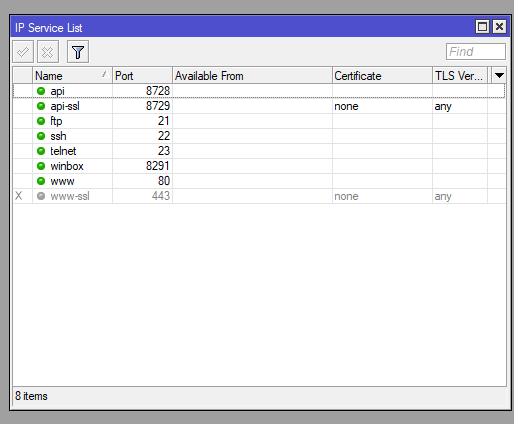

# LAB-10-Router-OS-services-Layanan-Router-OS
TANGGAL 14 AGUSTUS 2025

# servis pada mikrotik 
Service pada mikrotik memudahkan user dalam mengakses dan me-manage router,    
Secara default service ini akan dijalankan terus menerus oleh RB Mikrotik.   

# berikut penjelasan tentang fungsi masing masing service 
API Akses programatik untuk konfigurasi dan monitoring router menggunakan aplikasi atau script TCP 8728   
SSH	Akses CLI aman untuk konfigurasi router melalui terminal remote	TCP 22   
Telnet	Akses CLI standar (tidak aman) untuk konfigurasi router TCP 23   
Winbox Interface grafis untuk konfigurasi MikroTik secara mudah melalui aplikasi Winbox TCP 8291  
FTP	Transfer file ke/dari router TCP 21  
WWW Layanan web HTTP standar untuk mengakses WebFig TCP 80  
www-ssl Layanan web HTTPS (secure) untuk akses WebFig dengan enkripsi SSL/TLS	TCP 443  
api-ssl (API over SSL)	API MikroTik yang menggunakan koneksi terenkripsi SSL/TLS untuk keamanan komunikasi	TCP 8729   

# Cara mengamankan Service di Mikrotik

1. Cek Service yang Aktif    
   Buka Winbox pilih Menu: IP > Services    
 Atau di terminal:  

        /ip service print
   
2. Batasi Akses Service dengan IP Firewall  
   Batasi akses service hanya untuk IP tertentu.  
   Contoh batasi Winbox hanya untuk IP 192.168.88.0/24:  
   Di Winbox, di menu IP > Services, klik Winbox > klik Available From > masukkan 192.168.88.0/24  
Atau via terminal:  

       /ip service set winbox address=192.168.88.0/24

3. Nonaktifkan Service yang Tidak Digunakan  
   Service yang tidak dipakai sebaiknya dimatikan agar tidak menjadi celah keamanan.  
   Contoh nonaktifkan Telnet dan FTP (karena tidak aman):  
   Via Winbox: IP > Services, klik Telnet, klik tombol Disable   
Via terminal:   

        /ip service disable telnet
        /ip service disable ftp
  
4. Ganti Port Default Service  
   Mengganti port default service ke port lain bisa mengurangi risiko serangan otomatis (brute force).  
   Contoh ganti port SSH dari 22 ke 2222:  
   via Winbox: IP > Services > SSH > ubah port ke 2222  
via Terminal:  

        /ip service set ssh port=2222

5. Gunakan Password yang Kuat dan Unik  
   Pastikan user admin dan user lain memakai password yang kompleks dan sulit ditebak.  
Ganti password user admin:  
via Winbox: System > Users > double-click admin > ganti password  
Terminal:  

        /user set admin password=PasswordBaruYangKuat123!

6. Aktifkan Firewall untuk Melindungi Service  
   Tambahkan aturan firewall untuk menolak akses dari IP yang tidak dikenal.  
   Contoh blok semua akses Winbox dari luar jaringan lokal   
   via terminal:  
   
          /ip firewall filter add chain=input protocol=tcp dst-port=8291 src-address=!192.168.88.0/24 action=drop comment="Block Winbox access from outside"

7. Gunakan Service API-SSL dan SSH untuk Koneksi Aman  
   Jika menggunakan API, aktifkan api-ssl dan nonaktifkan API biasa  
   via terminal:    

         /ip service disable api
         /ip service enable api-ssl
   
    Gunakan SSH (bukan Telnet) karena SSH terenkripsi.  

9. Enable Security Features Lain  
   Aktifkan Login Attempt Limiting   
   via terminal:   

        /ip firewall filter add chain=input protocol=tcp dst-port=22 connection-state=new src-address-list=blacklist action=drop
        /ip firewall address-list add list=blacklist address=1.2.3.4 timeout=1d comment="blocked brute force IP"

Gunakan fitur Safe Mode saat konfigurasi supaya tidak terkunci akibat kesalahan konfigurasi.  

# kesimpulan 
Service MikroTik menyediakan kemudahan dalam manajemen dan komunikasi jaringan, tetapi juga harus diamankan dengan benar.  
Melakukan pengamanan service adalah bagian penting dari hardening RouterOS, demi menjaga kestabilan, privasi, dan keamanan jaringan kamu.  
